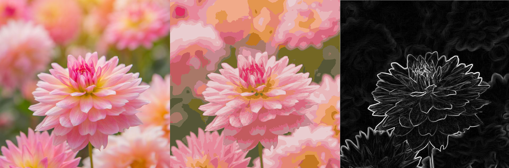

# Bot-Ross
Bot Ross is an image manipulation discord bot that uses my 
[sobel operator](https://github.com/danielholmes839/Sobel-Operator) and 
[kmeans filter](https://github.com/danielholmes839/KMeans-Image-Filter) through [discord](https://discordapp.com/).
Click [here]() to add Bot Ross to your discord server.

#### Examples
original - kmeans filter - sobel operator

#### Commands
- !help 
- !sobel url
- !compression n url
